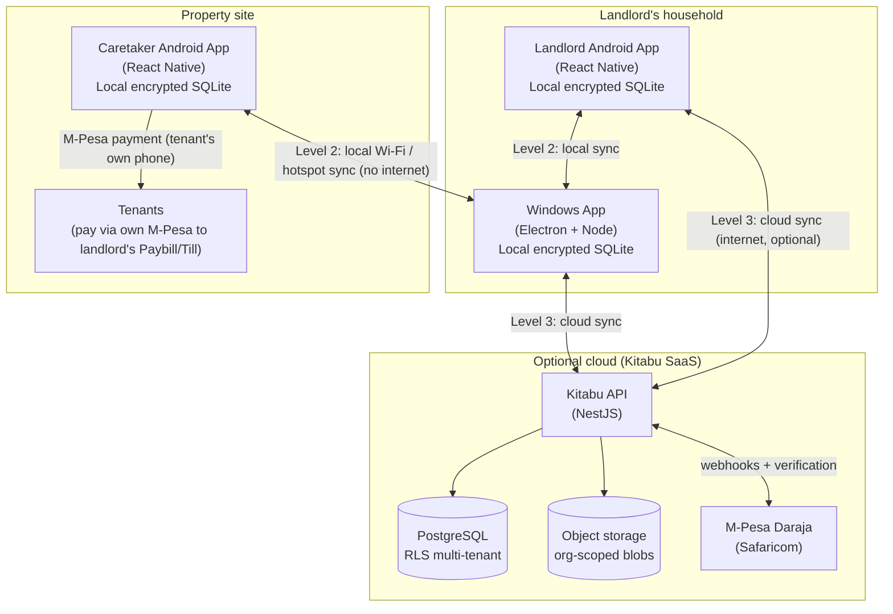
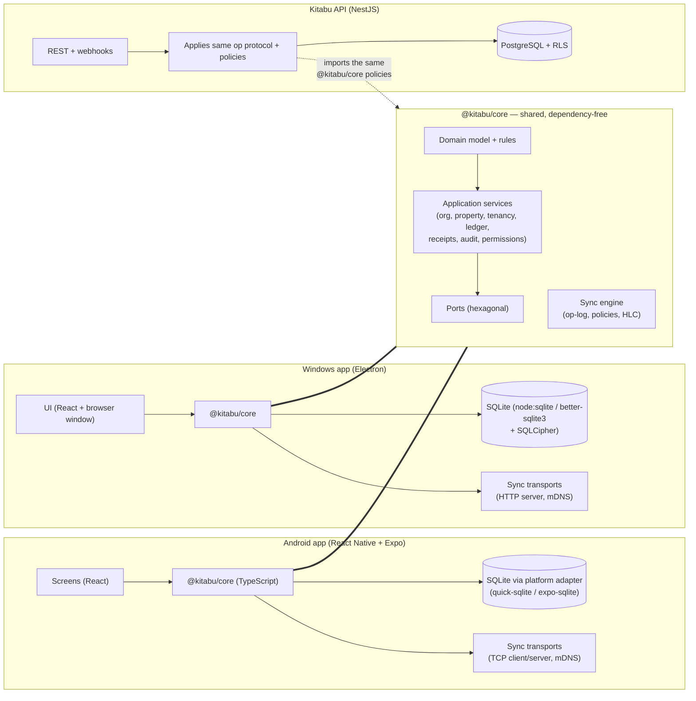

# Architecture

> Companion docs: [TECHNOLOGY-DECISIONS.md](TECHNOLOGY-DECISIONS.md) (why),
> [DATABASE.md](DATABASE.md) (schema), [SYNC.md](SYNC.md) (protocol),
> [SECURITY.md](SECURITY.md) (threat model), [FINANCIAL-LEDGER.md](FINANCIAL-LEDGER.md).

## 1. System context



Three sync levels (all use the **same op-log protocol**):

- **Level 1 — Single device.** The local SQLite database is the operational database,
  not a cache. Everything works here first.
- **Level 2 — Device ↔ device, no internet.** QR pairing → mDNS/manual-IP discovery →
  encrypted TCP/HTTP transport → op-log exchange.
- **Level 3 — Device ↔ cloud, optional.** Same op-log protocol; the server is another
  peer (with extra duties: sequencing, storage, recovery, entitlements).

## 2. Container view



**Key property:** the sync protocol, conflict policies, ledger math, permission checks
and receipt logic exist **once**, in `@kitabu/core`, and run in the Android app, the
Windows app, *and* the cloud server. The server is a peer in the protocol, so there is
no second implementation to drift out of sync.

## 3. Layering inside @kitabu/core

```
┌────────────────────────────────────────────────────────┐
│ Apps (React Native / Electron UI)  — presentation only │
├────────────────────────────────────────────────────────┤
│ Application services  (use cases, transactions,        │
│   permissions, audit, op-log recording)                │
├────────────────────────────────────────────────────────┤
│ Domain  (entities, value objects, invariants, state    │
│   machines: payment states, tenancy rules, ledger)     │
├────────────────────────────────────────────────────────┤
│ Ports: SqlitePort · ClockPort · RandomPort ·           │
│   CryptoPort · SyncTransportPort · MpesaProviderPort · │
│   AiProviderPort                                       │
├────────────────────────────────────────────────────────┤
│ Adapters: node:sqlite · RN quick-sqlite · system clock │
│   WebCrypto · LAN transport · cloud transport · Daraja │
└────────────────────────────────────────────────────────┘
```

Rules (enforced in review + tests):

- UI never touches SQL; only services.
- Services own transactions; every mutation runs in one, writes **audit** and **op-log**
  entries atomically with the data change.
- Financial logic lives only in the domain layer; never in UI or transport code.
- M-Pesa, AI, storage, crypto, time, randomness are behind ports — swappable and fakeable
  *in tests only* (production code never fakes verification).

## 4. Offline architecture — how zero-internet works

1. **No server dependency at startup.** The app opens its local SQLite file (encrypted;
   key from OS keystore), loads organization + settings, and is immediately usable.
   There is no "offline mode" flag — offline is the default state of the system.
2. **All writes are local writes.** A payment recorded on a caretaker's phone is a
   durable local transaction (WAL journaling). It is *saved* the moment the user sees
   "Saved ✓ — not yet synced".
3. **Connectivity is opportunistic.** Sync runs when the user taps *Sync now*, or when a
   known peer/cloud becomes reachable. Nothing queues on the network stack.
4. **Verification of M-Pesa refs degrades, not the app.** Offline, a reference is stored
   as `PENDING_VERIFICATION`; verification happens when any authorized device with
   connectivity and credentials can reach Daraja (directly, or via the cloud webhook).
5. **Entitlements are cached.** Plan limits come from the last known state with a grace
   period; a lapsed plan never bricks local operation (see PRD FR-30).
6. **AI degrades.** Without network, AI features are hidden/disabled; search, reports and
   everything else continue.

## 5. The local → cloud path (no rewrites, no duplicates)

The same mechanisms are reused at every level:

| Concern | Mechanism (single design) |
|---|---|
| Change capture | append-only op-log written in the same transaction as data |
| Backup | full snapshot export (schema + rows) — encrypted archive |
| New-device onboarding | snapshot restore + op-log tail replay |
| Local→cloud migration | snapshot upload + op-log tail (cloud dedupes by `change_id`) |
| Conflict metadata | row `version` + hybrid logical clock (`hlc`) per entity |

## 6. Repository layout

```
Kitabu-Digital/
├── docs/                    # this design package
├── packages/core/           # @kitabu/core — shared TypeScript core (no runtime deps)
│   ├── src/foundation/      # ids (UUIDv7/ULID), HLC, money, phone, clock, errors
│   ├── src/db/              # SqlitePort, schema, migrations, node adapter
│   ├── src/domain/          # entity types, enums, invariants
│   ├── src/services/        # organization, property, tenant, tenancy, audit, op-log
│   ├── src/sync/            # protocol types + apply engine (M5)
│   └── test/                # node:test suites (zero-dependency)
├── apps/                    # (M3+) apps/mobile (RN), apps/desktop (Electron)
├── server/                  # (M6+) NestJS API
└── tools/                   # scripts, fixtures, contract tests
```

## 7. Runtime technology map (summary — full comparison in TECHNOLOGY-DECISIONS.md)

| Concern | Choice |
|---|---|
| Android app | React Native (Expo dev-client) + TypeScript |
| Windows app | Electron + React + TypeScript (Node 22 runtime) |
| Shared core | `@kitabu/core` — pure TypeScript, zero runtime deps |
| Local DB | SQLite (SQLCipher-encrypted in shells) via `SqlitePort` |
| Cloud API | NestJS (TypeScript) — imports core policies |
| Cloud DB | PostgreSQL with row-level security per organization |
| Object storage | S3-compatible (Cloudflare R2 / S3), org-prefixed keys |
| M-Pesa | Safaricom Daraja 2.0 behind `MpesaProviderPort` |
| AI | Provider-agnostic behind `AiProviderPort` (OpenAI-compatible, Anthropic, Google) |

## 8. Key architectural invariants (must hold at all times)

1. Every mutation is one transaction: **data + audit + op-log**, or nothing.
2. Rows carry `id, org_id, created_at, updated_at, deleted_at, version, hlc,
   origin_device_id` (synced tables).
3. IDs are generated on-device (UUIDv7 rows / ULID ops) — never server-issued.
4. Money is integer minor units (cents). No floats anywhere.
5. Financial rows are append-only; corrections are new rows (reversals/adjustments).
6. Issued receipts are immutable snapshots.
7. The server never trusts client-supplied `org_id` — it derives it from verified
   identity, and RLS enforces it at the database level.
8. Tests may fake external providers; production code paths never fake verification.
