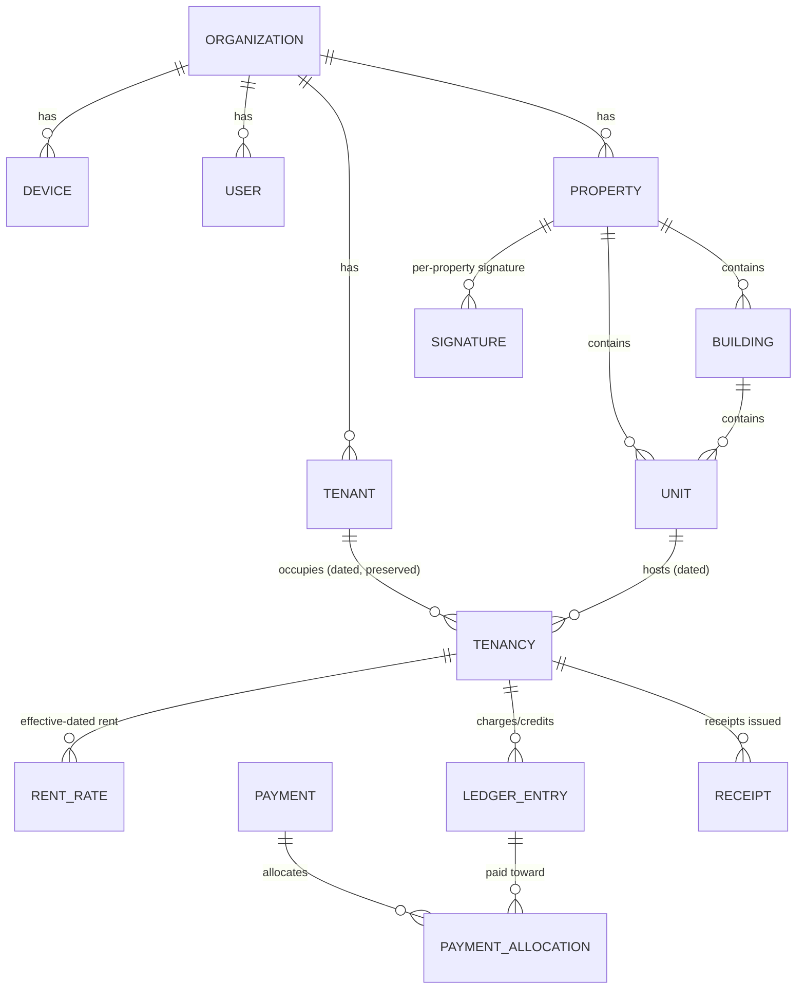

# Database Design

Local database: **SQLite** (encrypted via SQLCipher in app shells). Cloud database:
**PostgreSQL** with row-level security. The canonical DDL lives in
`packages/core/src/db/schema.ts` (local) — this document is the human-readable reference.

## 1. Conventions

**Synced tables** (replicated between devices/cloud) all carry:

```sql
id               TEXT PRIMARY KEY      -- UUIDv7, generated on-device
org_id           TEXT NOT NULL         -- organization scope
created_at       TEXT NOT NULL         -- ISO-8601 UTC
updated_at       TEXT NOT NULL         -- ISO-8601 UTC
deleted_at       TEXT NULL             -- soft delete (tombstone preserved in op-log)
version          INTEGER NOT NULL      -- per-row revision, +1 on every mutation
hlc              TEXT NOT NULL         -- hybrid logical clock of last mutation
origin_device_id TEXT NOT NULL         -- device that created the row
```

- **Booleans** are `INTEGER 0/1` (SQLite has no bool).
- **Money** is `INTEGER` minor units (cents of KSh). Never floats.
- **Dates** (rental dates) are `TEXT YYYY-MM-DD` (calendar dates, no time component).
- **JSON** payloads stored as `TEXT` (JSON.stringify).
- **Local-only tables** (`change_log`, `sync_state`, `app_settings`, `local_credentials`,
  `receipt_blocks` local view) are never replicated as rows; they are per-device state.
- Foreign keys are enforced (`PRAGMA foreign_keys = ON`).

## 2. Entity relationships



## 3. Schema v1 — local core (implemented in Milestone 1)

### organizations
```sql
CREATE TABLE organizations (
  id TEXT PRIMARY KEY, org_id TEXT NOT NULL,            -- org.org_id = own id
  name TEXT NOT NULL CHECK (length(trim(name)) > 0),
  landlord_name TEXT, kra_pin TEXT, phone TEXT,
  default_unit_term TEXT NOT NULL DEFAULT 'House',      -- House | Unit | Room | Apartment
  currency TEXT NOT NULL DEFAULT 'KES',
  timezone TEXT NOT NULL DEFAULT 'Africa/Nairobi',
  cloud_org_id TEXT,                                    -- set when linked to cloud (M6)
  created_at TEXT NOT NULL, updated_at TEXT NOT NULL, deleted_at TEXT,
  version INTEGER NOT NULL, hlc TEXT NOT NULL, origin_device_id TEXT NOT NULL
);
```

### devices — organization's trusted devices (each local DB stores all, self flagged)
```sql
CREATE TABLE devices (
  id TEXT PRIMARY KEY, org_id TEXT NOT NULL,
  name TEXT NOT NULL,
  platform TEXT NOT NULL CHECK (platform IN ('ANDROID','WINDOWS')),
  status TEXT NOT NULL DEFAULT 'ACTIVE' CHECK (status IN ('ACTIVE','REVOKED')),
  key_fingerprint TEXT,          -- Ed25519 public key fingerprint (paired devices)
  is_self INTEGER NOT NULL DEFAULT 0,
  paired_at TEXT NOT NULL, last_seen_at TEXT, last_sync_hlc TEXT,
  created_at TEXT NOT NULL, updated_at TEXT NOT NULL, deleted_at TEXT,
  version INTEGER NOT NULL, hlc TEXT NOT NULL, origin_device_id TEXT NOT NULL
);
CREATE INDEX idx_devices_org ON devices(org_id);
```

### users — organization members (role model)
```sql
CREATE TABLE users (
  id TEXT PRIMARY KEY, org_id TEXT NOT NULL,
  full_name TEXT NOT NULL, phone TEXT, email TEXT,
  role TEXT NOT NULL CHECK (role IN ('OWNER','MANAGER','CARETAKER')),
  is_active INTEGER NOT NULL DEFAULT 1,
  created_at TEXT NOT NULL, updated_at TEXT NOT NULL, deleted_at TEXT,
  version INTEGER NOT NULL, hlc TEXT NOT NULL, origin_device_id TEXT NOT NULL
);
CREATE INDEX idx_users_org ON users(org_id);
```

### properties / buildings / units
```sql
CREATE TABLE properties (
  id TEXT PRIMARY KEY, org_id TEXT NOT NULL,
  name TEXT NOT NULL CHECK (length(trim(name)) > 0),
  town TEXT, estate TEXT, notes TEXT,
  created_at TEXT NOT NULL, updated_at TEXT NOT NULL, deleted_at TEXT,
  version INTEGER NOT NULL, hlc TEXT NOT NULL, origin_device_id TEXT NOT NULL
);
CREATE INDEX idx_properties_org ON properties(org_id);

CREATE TABLE buildings (
  id TEXT PRIMARY KEY, org_id TEXT NOT NULL,
  property_id TEXT NOT NULL REFERENCES properties(id),
  name TEXT NOT NULL, notes TEXT,
  created_at TEXT NOT NULL, updated_at TEXT NOT NULL, deleted_at TEXT,
  version INTEGER NOT NULL, hlc TEXT NOT NULL, origin_device_id TEXT NOT NULL
);
CREATE INDEX idx_buildings_property ON buildings(property_id);

CREATE TABLE units (
  id TEXT PRIMARY KEY, org_id TEXT NOT NULL,
  property_id TEXT NOT NULL REFERENCES properties(id),
  building_id TEXT REFERENCES buildings(id),
  label TEXT NOT NULL,                            -- e.g. 'A-12'
  kind TEXT NOT NULL DEFAULT 'HOUSE'
       CHECK (kind IN ('HOUSE','APARTMENT','ROOM','BEDSITTER','SHOP','OTHER')),
  status TEXT NOT NULL DEFAULT 'VACANT'
       CHECK (status IN ('VACANT','OCCUPIED','RESERVED','MAINTENANCE')),
  notes TEXT,
  created_at TEXT NOT NULL, updated_at TEXT NOT NULL, deleted_at TEXT,
  version INTEGER NOT NULL, hlc TEXT NOT NULL, origin_device_id TEXT NOT NULL
);
CREATE INDEX idx_units_property ON units(org_id, property_id);
CREATE INDEX idx_units_status ON units(org_id, status);
CREATE UNIQUE INDEX idx_units_label ON units(property_id, label)
  WHERE deleted_at IS NULL;
```

### tenants
```sql
CREATE TABLE tenants (
  id TEXT PRIMARY KEY, org_id TEXT NOT NULL,
  full_name TEXT NOT NULL CHECK (length(trim(full_name)) > 0),
  phone TEXT, alt_phone TEXT,          -- E.164 '+2547XXXXXXXX'
  id_number TEXT, email TEXT, emergency_contact TEXT, notes TEXT,
  created_at TEXT NOT NULL, updated_at TEXT NOT NULL, deleted_at TEXT,
  version INTEGER NOT NULL, hlc TEXT NOT NULL, origin_device_id TEXT NOT NULL
);
CREATE INDEX idx_tenants_org_name ON tenants(org_id, full_name);
CREATE INDEX idx_tenants_org_phone ON tenants(org_id, phone);
```

### tenancies — dated occupancy, the historical record
```sql
CREATE TABLE tenancies (
  id TEXT PRIMARY KEY, org_id TEXT NOT NULL,
  tenant_id TEXT NOT NULL REFERENCES tenants(id),
  unit_id TEXT NOT NULL REFERENCES units(id),
  property_id TEXT NOT NULL REFERENCES properties(id),   -- denormalized for reports
  start_date TEXT NOT NULL,                              -- YYYY-MM-DD
  end_date TEXT,                                         -- NULL while active
  end_reason TEXT,
  expected_payment_day INTEGER NOT NULL DEFAULT 5 CHECK (expected_payment_day BETWEEN 1 AND 28),
  deposit_amount_minor INTEGER NOT NULL DEFAULT 0 CHECK (deposit_amount_minor >= 0),
  deposit_paid INTEGER NOT NULL DEFAULT 0,
  current_rent_minor INTEGER NOT NULL,                   -- denormalized active rate
  status TEXT NOT NULL CHECK (status IN ('ACTIVE','ENDED')),
  notes TEXT,
  created_at TEXT NOT NULL, updated_at TEXT NOT NULL, deleted_at TEXT,
  version INTEGER NOT NULL, hlc TEXT NOT NULL, origin_device_id TEXT NOT NULL,
  CHECK (end_date IS NULL OR end_date >= start_date)
);
CREATE INDEX idx_tenancies_unit ON tenancies(org_id, unit_id, status);
CREATE INDEX idx_tenancies_tenant ON tenancies(org_id, tenant_id, status);
CREATE UNIQUE INDEX idx_tenancies_one_active_per_unit
  ON tenancies(unit_id) WHERE status = 'ACTIVE';
```

### rent_rates — effective-dated rent (never edit history)
```sql
CREATE TABLE rent_rates (
  id TEXT PRIMARY KEY, org_id TEXT NOT NULL,
  tenancy_id TEXT NOT NULL REFERENCES tenancies(id),
  effective_from TEXT NOT NULL,             -- YYYY-MM-DD
  amount_minor INTEGER NOT NULL CHECK (amount_minor > 0),
  reason TEXT, created_by_user_id TEXT,
  created_at TEXT NOT NULL, updated_at TEXT NOT NULL, deleted_at TEXT,
  version INTEGER NOT NULL, hlc TEXT NOT NULL, origin_device_id TEXT NOT NULL
);
CREATE UNIQUE INDEX idx_rent_rates_tenancy_effective
  ON rent_rates(tenancy_id, effective_from);
```

### audit_log — append-only, synced (organization-wide trail)
```sql
CREATE TABLE audit_log (
  id TEXT PRIMARY KEY, org_id TEXT NOT NULL,
  occurred_at TEXT NOT NULL,
  actor_user_id TEXT, actor_device_id TEXT NOT NULL,
  action TEXT NOT NULL,                    -- e.g. TENANCY_STARTED, PAYMENT_VERIFIED
  entity_type TEXT NOT NULL, entity_id TEXT,
  summary TEXT NOT NULL,                   -- human-readable, e.g. "John moved to B-04"
  before_json TEXT, after_json TEXT,
  created_at TEXT NOT NULL, updated_at TEXT NOT NULL, deleted_at TEXT,
  version INTEGER NOT NULL, hlc TEXT NOT NULL, origin_device_id TEXT NOT NULL
);
CREATE INDEX idx_audit_org_time ON audit_log(org_id, occurred_at);
CREATE INDEX idx_audit_entity ON audit_log(entity_type, entity_id);
```

### change_log — LOCAL ONLY: the device's complete operation stream
```sql
CREATE TABLE change_log (
  seq INTEGER PRIMARY KEY AUTOINCREMENT,
  change_id TEXT NOT NULL UNIQUE,          -- ULID (cursor-safe)
  org_id TEXT NOT NULL,
  table_name TEXT NOT NULL, row_id TEXT NOT NULL,
  op TEXT NOT NULL CHECK (op IN ('UPSERT','DELETE')),
  payload_json TEXT NOT NULL,              -- full row snapshot after the change
  row_version INTEGER NOT NULL,
  hlc TEXT NOT NULL,                       -- ordering key (with change_id tiebreak)
  origin_device_id TEXT NOT NULL,
  created_at TEXT NOT NULL
);
CREATE INDEX idx_changelog_hlc ON change_log(hlc, change_id);
CREATE INDEX idx_changelog_row ON change_log(table_name, row_id);
```

### app_settings — LOCAL ONLY key/value
```sql
CREATE TABLE app_settings (key TEXT PRIMARY KEY, value TEXT NOT NULL);
```

## 4. Schema v2 — financial core (implemented in Milestone 2)

### ledger_entries — append-only financial journal
```sql
CREATE TABLE ledger_entries (
  id TEXT PRIMARY KEY, org_id TEXT NOT NULL,
  tenancy_id TEXT NOT NULL REFERENCES tenancies(id),
  property_id TEXT NOT NULL, unit_id TEXT NOT NULL, tenant_id TEXT NOT NULL,  -- denormalized
  entry_date TEXT NOT NULL,               -- effective date (charge month due date, payment date)
  entry_type TEXT NOT NULL CHECK (entry_type IN
    ('CHARGE','PAYMENT_CREDIT','ADJUSTMENT','REVERSAL')),
  direction TEXT NOT NULL CHECK (direction IN ('DEBIT','CREDIT')),
  amount_minor INTEGER NOT NULL CHECK (amount_minor > 0),  -- always positive; direction signs it
  kind TEXT NOT NULL DEFAULT 'RENT' CHECK (kind IN
    ('RENT','WATER','GARBAGE','LATE_FEE','PENALTY','DISCOUNT','OTHER')),
  period TEXT,                            -- 'YYYY-MM' for rent charges
  payment_id TEXT,                        -- set for PAYMENT_CREDIT (FK payments, added in M2)
  reversal_of TEXT REFERENCES ledger_entries(id),
  reason TEXT, note TEXT,
  source TEXT NOT NULL DEFAULT 'MANUAL' CHECK (source IN
    ('AUTO_GENERATED','MANUAL','SYNC','MIGRATION')),
  posted_by_user_id TEXT, posted_by_device_id TEXT NOT NULL,
  created_at TEXT NOT NULL, updated_at TEXT NOT NULL, deleted_at TEXT,
  version INTEGER NOT NULL, hlc TEXT NOT NULL, origin_device_id TEXT NOT NULL
);
CREATE INDEX idx_ledger_tenancy ON ledger_entries(org_id, tenancy_id, entry_date);
CREATE INDEX idx_ledger_period ON ledger_entries(org_id, period, kind);
-- Balance(tenancy) = SUM(DEBIT) - SUM(CREDIT). Reversals net out naturally.
```

### payments — verification state machine
```sql
CREATE TABLE payments (
  id TEXT PRIMARY KEY, org_id TEXT NOT NULL,
  tenancy_id TEXT NOT NULL REFERENCES tenancies(id),
  property_id TEXT NOT NULL, unit_id TEXT NOT NULL, tenant_id TEXT NOT NULL,
  amount_minor INTEGER NOT NULL CHECK (amount_minor > 0),
  method TEXT NOT NULL CHECK (method IN ('CASH','MPESA','BANK','OTHER')),
  paid_at TEXT NOT NULL,                   -- date tenant paid
  reference TEXT,                          -- M-Pesa code / bank slip (normalized uppercase)
  payer_name TEXT,
  status TEXT NOT NULL DEFAULT 'PENDING' CHECK (status IN
    ('PENDING','VERIFYING','VERIFIED','REJECTED','REVERSED')),
  verified_at TEXT, verified_by_user_id TEXT, verification_note TEXT,
  reversal_reason TEXT,
  recorded_by_user_id TEXT, recorded_by_device_id TEXT NOT NULL,
  created_at TEXT NOT NULL, updated_at TEXT NOT NULL, deleted_at TEXT,
  version INTEGER NOT NULL, hlc TEXT NOT NULL, origin_device_id TEXT NOT NULL
);
CREATE UNIQUE INDEX idx_payments_ref ON payments(org_id, method, reference)
  WHERE reference IS NOT NULL;   -- duplicate M-Pesa codes impossible per organization
CREATE INDEX idx_payments_status ON payments(org_id, status);
CREATE INDEX idx_payments_tenancy ON payments(org_id, tenancy_id, paid_at);
```

### payment_allocations — how payments settle charges (waterfall)
```sql
CREATE TABLE payment_allocations (
  id TEXT PRIMARY KEY, org_id TEXT NOT NULL,
  payment_id TEXT NOT NULL REFERENCES payments(id),
  charge_id TEXT NOT NULL REFERENCES ledger_entries(id),
  amount_minor INTEGER NOT NULL CHECK (amount_minor > 0),
  created_at TEXT NOT NULL, updated_at TEXT NOT NULL, deleted_at TEXT,
  version INTEGER NOT NULL, hlc TEXT NOT NULL, origin_device_id TEXT NOT NULL
);
```

### receipts + signatures (see RECEIPTS.md for numbering & immutability)
```sql
CREATE TABLE receipts (
  id TEXT PRIMARY KEY, org_id TEXT NOT NULL,
  receipt_no TEXT NOT NULL,                -- 'R-000123' (device-reserved blocks)
  payment_id TEXT NOT NULL REFERENCES payments(id),
  tenancy_id TEXT NOT NULL, property_id TEXT NOT NULL,
  snapshot_json TEXT NOT NULL,             -- full display data frozen at issuance
  digest TEXT NOT NULL,                    -- sha256(canonical snapshot JSON)
  signature_image_id TEXT REFERENCES signature_images(id),
  signature_digest TEXT,                   -- sha256 of signature image used
  crypto_signature TEXT,                   -- Ed25519 signature over digest (org key)
  issued_by_user_id TEXT, issued_by_device_id TEXT NOT NULL,
  voided_at TEXT, void_reason TEXT,        -- corrections void + reissue; never edit
  created_at TEXT NOT NULL, updated_at TEXT NOT NULL, deleted_at TEXT,
  version INTEGER NOT NULL, hlc TEXT NOT NULL, origin_device_id TEXT NOT NULL
);
CREATE UNIQUE INDEX idx_receipts_no ON receipts(org_id, receipt_no);

CREATE TABLE signature_images (
  id TEXT PRIMARY KEY, org_id TEXT NOT NULL,
  property_id TEXT,                        -- NULL = organization default
  label TEXT NOT NULL DEFAULT 'Signature',
  image_ref TEXT NOT NULL,                 -- content-addressed blob id (documents table)
  image_digest TEXT NOT NULL,
  active_from TEXT NOT NULL, active_to TEXT,
  created_at TEXT NOT NULL, updated_at TEXT NOT NULL, deleted_at TEXT,
  version INTEGER NOT NULL, hlc TEXT NOT NULL, origin_device_id TEXT NOT NULL
);

CREATE TABLE receipt_number_blocks (      -- local allocation of per-org sequence blocks
  id TEXT PRIMARY KEY, org_id TEXT NOT NULL,
  device_id TEXT NOT NULL, block_start INTEGER NOT NULL, block_end INTEGER NOT NULL,
  next_value INTEGER NOT NULL,
  created_at TEXT NOT NULL, updated_at TEXT NOT NULL, deleted_at TEXT,
  version INTEGER NOT NULL, hlc TEXT NOT NULL, origin_device_id TEXT NOT NULL,
  CHECK (block_start >= 1 AND block_end >= block_start AND next_value BETWEEN block_start AND block_end + 1)
);
```

### org_keys — device org signing keys (one row per purpose)
```sql
CREATE TABLE org_keys (
  id TEXT PRIMARY KEY, org_id TEXT NOT NULL,
  purpose TEXT NOT NULL,                    -- 'RECEIPTS' (Ed25519 receipt signing)
  public_key TEXT NOT NULL,                 -- SPKI, base64
  private_key TEXT NOT NULL,                -- PKCS8, base64 (device-local secret)
  created_at TEXT NOT NULL, updated_at TEXT NOT NULL, deleted_at TEXT,
  version INTEGER NOT NULL, hlc TEXT NOT NULL, origin_device_id TEXT NOT NULL
);
CREATE UNIQUE INDEX idx_org_keys_purpose ON org_keys(org_id, purpose);
```
One row per org per purpose — a second insert is rejected, so the org's receipt
identity can never silently fork. The row syncs with the org so paired devices can
verify and reissue receipts; inside the local database it is protected by the
SQLCipher container (app shells, M3), with OS-keystore wrapping as the hardening
step called for by SECURITY.md/RECEIPTS.md.

### Immutability & integrity triggers (M2) — database-level enforcement
Nine triggers in `schema.ts` (v2) guard the books; the same rules apply to the
Postgres cloud copy in M6:

| Trigger | Table | Enforces |
| --- | --- | --- |
| `trg_ledger_entries_no_update` / `_no_delete` | `ledger_entries` | The journal is append-only — no row can ever change or disappear. |
| `trg_payments_status_transition` | `payments` | State machine: PENDING→VERIFYING/VERIFIED/REJECTED, VERIFYING→VERIFIED/REJECTED/PENDING, VERIFIED→REVERSED. REJECTED and REVERSED are terminal. |
| `trg_payments_immutable` | `payments` | Once VERIFIED/REVERSED, amount, method, `paid_at`, reference, tenancy and tenant are frozen. |
| `trg_payment_allocations_no_update` / `_no_delete` | `payment_allocations` | Waterfall history is append-only — allocations can never be rewritten to move money after the fact. |
| `trg_allocations_within_payment` | `payment_allocations` | `SUM(allocations) ≤ payment.amount` — a payment can never allocate more than it was for. |
| `trg_receipts_immutable` | `receipts` | Number, snapshot, digest and signatures are frozen; only `voided_at`/`void_reason`/sync columns may change. |
| `trg_receipts_no_delete` | `receipts` | Receipts are never deleted — corrections void and reissue. |

## 5. Schema v3 — operations (Milestone 4)

- `expenses` (org, property, category, amount_minor, spent_at, description, method,
  reference, recorded_by, sync columns; categories: REPAIRS, PLUMBING, ELECTRICITY,
  WATER, GARBAGE, SECURITY, CLEANING, WAGES, MATERIALS, TAXES_FEES, OTHER)
- `maintenance_requests` (org, property, unit, tenancy?, title, description, priority
  LOW/NORMAL/HIGH/URGENT, status REPORTED/ASSIGNED/IN_PROGRESS/COMPLETED/CANCELLED,
  reported_by, assigned_to, reported_at, completed_at, cost_minor, sync columns)
- `documents` (org, owner_type/owner_id, kind, filename, mime, size, content_sha256,
  storage_ref — content-addressed so identical files sync once, sync columns)
- `notifications` (org, user, type, payload_json, read_at, sync columns)
- FTS5 virtual tables for offline search (tenants, payments refs, receipt numbers).

## 6. Cloud schema (PostgreSQL, M6)

Mirrors the synced tables with:

- `org_id uuid` on every table, `id uuid`, same change-tracking columns.
- **Row-level security** on every tenant table:
  ```sql
  ALTER TABLE tenants ENABLE ROW LEVEL SECURITY;
  CREATE POLICY tenant_isolation ON tenants
    USING (org_id = current_setting('app.org_id')::uuid);
  ```
  The API sets `app.org_id` inside each transaction **after** verifying membership from
  the verified JWT — clients never supply `org_id`.
- Append-only `org_changes(change_id ulid PRIMARY KEY, org_id, ...)` — the server's copy
  of the op stream, per-org indexed; the dedupe point for all sync topologies.
- `accounts`, `account_org_memberships` (multi-org support), `devices` (authoritative
  device registry + revocation), `subscriptions`/`plans`/`entitlements`,
  `mpesa_transactions` (webhook inbox, pre-matching).
- Object storage layout: `org/{orgId}/{contentSha256}` — server-issued signed URLs only
  after membership check; no per-tenant buckets needed (keys are scoped + authorized).

## 7. Migration strategy

- Local: sequential schema versions via `PRAGMA user_version`; every migration is pure
  SQL + tested against fixture databases (upgrade path tests in CI).
- Cloud: tracked SQL files applied by the API's migrate command; backward-compatible
  (add columns/tables first, deploy, then remove old paths).
- Op payloads embed the schema version they were written under; the apply engine
  tolerates unknown columns (forward-compatibility for older devices).
